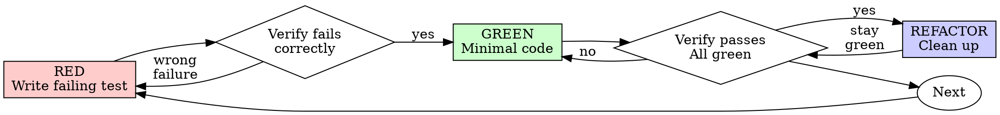

---
name: test-driven-development
description: Use when implementing any feature or bugfix, before writing implementation code
---
```

# Test-Driven Development (TDD)

## Overview

Write the test first. Watch it fail. Write minimal code to pass.

**Core principle:** If you didn't watch the test fail, you don't know if it tests the right thing.

**Violating the letter of the rules is violating the spirit of the rules.**

## When to Use

**Always:**

* New features
* Bug fixes
* Refactoring
* Behavior changes

**Exceptions (ask your human partner):**

* Throwaway prototypes
* Generated code
* Configuration files

Thinking "skip TDD just this once"? Stop. That's rationalization.

## The Iron Law

```
NO PRODUCTION CODE WITHOUT A FAILING TEST FIRST
```

Write code before the test? Delete it. Start over.

**No exceptions:**

* Don't keep it as "reference"
* Don't "adapt" it while writing tests
* Don't look at it
* Delete means delete

Implement fresh from tests. Period.

## Red-Green-Refactor



### RED - Write Failing Test

Write one minimal test showing what should happen.

<Good>
```kotlin
@Test
fun `retries failed operation 3 times`() = runTest {
    var attempts = 0
    val operation = suspend {
        attempts++
        if (attempts < 3) throw RuntimeException("fail")
        "success"
    }

```
val result = retryOperation(operation)

assertEquals("success", result)
assertEquals(3, attempts)
```

}

````
Clear name, tests real behavior, one thing  
</Good>

<Bad>
```kotlin
@Test
fun `retry works`() = runTest {
    val mock = mockk<suspend () -> String>()
    coEvery { mock.invoke() } throws RuntimeException() andThenThrows RuntimeException() andThen "success"

    retryOperation(mock)

    coVerify(exactly = 3) { mock.invoke() }
}
````

Vague name, tests mock not code </Bad>

**Requirements:**

* One behavior
* Clear name
* Real code (no mocks unless unavoidable)

### Verify RED - Watch It Fail

**MANDATORY. Never skip.**

```bash
./gradlew test --tests RetryOperationTest
```

Confirm:

* Test fails (not errors)
* Failure message is expected
* Fails because feature missing (not typos)

**Test passes?** You're testing existing behavior. Fix test.

**Test errors?** Fix error, re-run until it fails correctly.

### GREEN - Minimal Code

Write simplest code to pass the test.

<Good>
```kotlin
suspend fun <T> retryOperation(fn: suspend () -> T): T {
    repeat(3) { attempt ->
        try {
            return fn()
        } catch (e: Exception) {
            if (attempt == 2) throw e
        }
    }
    error("unreachable")
}
```
Just enough to pass  
</Good>

<Bad>
```kotlin
suspend fun <T> retryOperation(
    fn: suspend () -> T,
    maxRetries: Int = 3,
    backoff: BackoffStrategy = BackoffStrategy.EXPONENTIAL,
    onRetry: (Int) -> Unit = {}
): T {
    // YAGNI
}
```
Over-engineered  
</Bad>

Don't add features, refactor other code, or "improve" beyond the test.

### Verify GREEN - Watch It Pass

**MANDATORY.**

```bash
./gradlew test --tests RetryOperationTest
```

Confirm:

* Test passes
* Other tests still pass
* Output pristine (no errors, warnings)

**Test fails?** Fix code, not test.

**Other tests fail?** Fix now.

### REFACTOR - Clean Up

After green only:

* Remove duplication
* Improve names
* Extract helpers

Keep tests green. Don't add behavior.

### Repeat

Next failing test for next feature.

## Good Tests

| Quality          | Good                                | Bad                                         |
| ---------------- | ----------------------------------- | ------------------------------------------- |
| **Minimal**      | One thing. "and" in name? Split it. | `validates email and domain and whitespace` |
| **Clear**        | Name describes behavior             | `test1`                                     |
| **Shows intent** | Demonstrates desired API            | Obscures what code should do                |

## Why Order Matters

**"I'll write tests after to verify it works"**

Tests written after code pass immediately. Passing immediately proves nothing:

* Might test wrong thing
* Might test implementation, not behavior
* Might miss edge cases you forgot
* You never saw it catch the bug

Test-first forces you to see the test fail, proving it actually tests something.

**"I already manually tested all the edge cases"**

Manual testing is ad-hoc:

* No record
* Can't re-run
* Easy to forget cases
* "It worked once" ≠ coverage

Automated tests are systematic and repeatable.

**"Deleting X hours of work is wasteful"**

Sunk cost fallacy. The real waste is code you can't trust.

## Example: Bug Fix

**Bug:** Empty email accepted

**RED**

```kotlin
@Test
fun `rejects empty email`() {
    val result = submitForm(FormData(email = ""))

    assertEquals("Email required", result.error)
}
```

**Verify RED**

```bash
FAIL: expected 'Email required', got null
```

**GREEN**

```kotlin
fun submitForm(data: FormData): Result {
    if (data.email.isBlank()) {
        return Result(error = "Email required")
    }
    // ...
}
```

**Verify GREEN**

```bash
PASS
```

**REFACTOR**
Extract validation if needed.

## Verification Checklist

* [ ] Every new function has a test
* [ ] Watched test fail before implementation
* [ ] Failure reason understood
* [ ] Minimal code written
* [ ] All tests pass
* [ ] No warnings/errors
* [ ] Real behavior tested
* [ ] Edge cases covered

Can't check all boxes? You skipped TDD. Start over.

## Final Rule

```
Production code → test exists and failed first
Otherwise → not TDD
```

No exceptions without your human partner’s permission.

